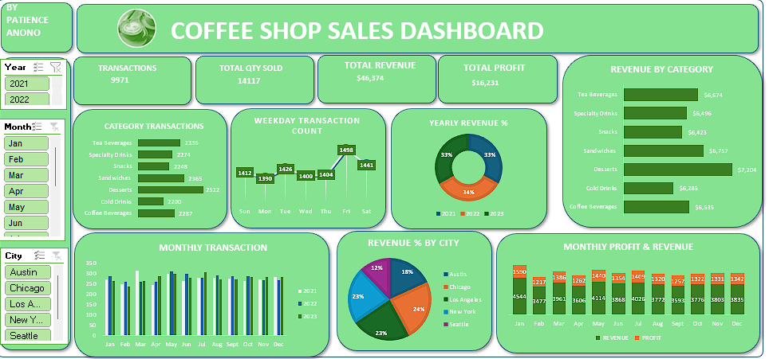
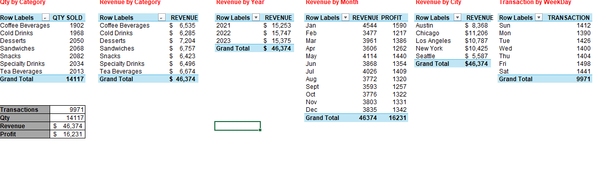

# ☕ Coffee Sales Performance Dashboard (Excel)

Built by **Patience Anono**  
Data Analyst | Data Consultant | SQL | Python | Power BI | Excel

---

## 📊 Project Overview

This project presents a **Coffee Sales Performance Dashboard built in Microsoft Excel** to analyze sales trends and extract actionable insights from transactional data.

Using pivot tables, calculated time fields and interactive visualizations, the dashboard transforms raw sales data into structured insights that help monitor business performance.

The analysis focuses on **time-based sales patterns, product performance and revenue trends**, enabling stakeholders to better understand sales behavior and support data-driven decision making.

---

## 🛠 Tools & Techniques Used

- **Microsoft Excel**
- Pivot Tables
- Pivot Charts
- Calculated Fields (Year, Month, Week)
- Dashboard Design
- Data Cleaning & Preparation
- Time-based Sales Analysis

---

## 📈 Dashboard Preview

### Sales Dashboard

### Pivot Table Analysis

---

## 📊 Business Questions

This analysis was designed to answer key business questions such as:

- What are the **monthly and weekly trends in coffee sales**?
- Which time periods generate the **highest revenue**?
- How do sales patterns change across **months and weeks**?
- Are there observable **seasonal trends** in coffee sales performance?
- How can time-based insights help improve **sales planning and forecasting**?

---

## 📈 Key Metrics Analyzed

The dashboard focuses on several important performance indicators:

- **Total Sales Revenue**
- **Monthly Sales Performance**
- **Weekly Sales Trends**
- **Time-Based Sales Analysis (Year → Month → Week)**
- **Pivot Table Aggregations for Sales Insights**

These metrics help convert raw transactional data into meaningful performance insights.

---

## ⭐ Key Insights

From the analysis, several important patterns can be identified:

- Coffee sales show **clear monthly performance patterns**, indicating varying demand across different periods.
- Weekly analysis highlights **short-term fluctuations in purchasing behavior**.
- Time-based segmentation helps identify **seasonality and demand cycles**.
- Pivot table analysis provides a scalable method for **monitoring sales performance and identifying trends over time**.

These insights demonstrate how Excel dashboards can be used as a **powerful analytical tool for sales performance monitoring**.

---

## 📁 Files Included

- `Coffee_Sales_Dashboard.xlsx`
- `dashboard_overview.png`
- `pivot_analysis1.png`
- `dataset_preview.png`

---

## 💡 Business Value

This project demonstrates how **Excel can be used as a practical business intelligence tool** to transform raw sales data into clear, structured insights.

By leveraging pivot tables and dashboards, businesses can quickly monitor performance trends and support **data-driven decision making**.

---
